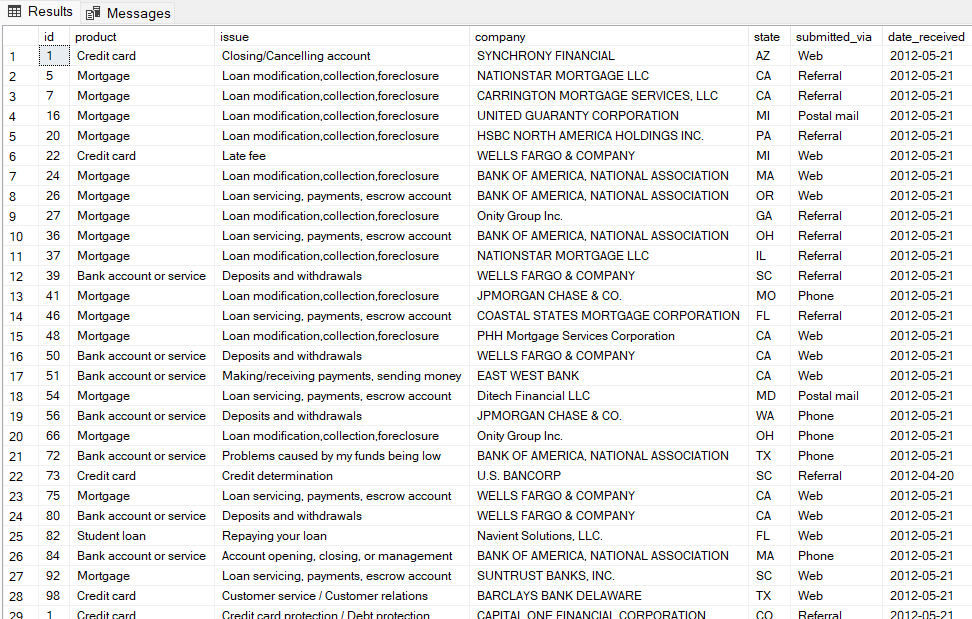
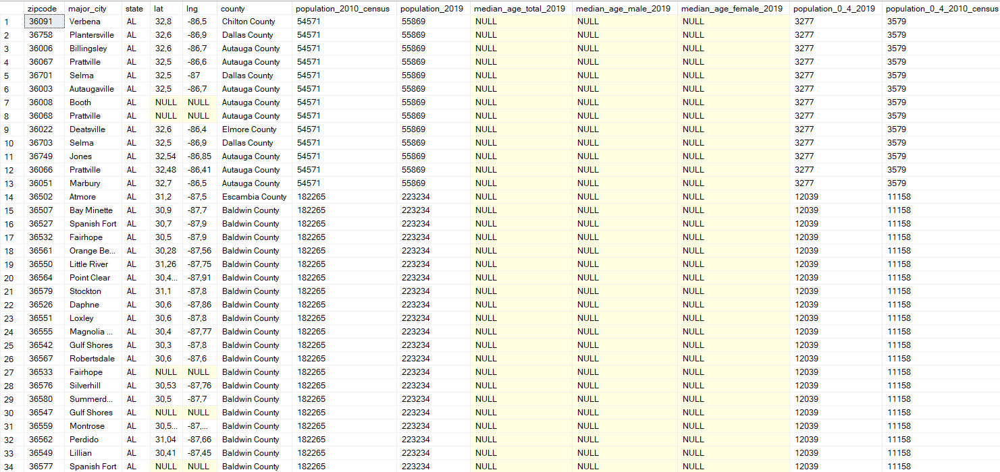

## **Building an End-to-End Data Pipeline with MS SQL Server**
## **Overview**
This project outlines building an end-to-end data pipeline using **MS SQL Server**. The pipeline covers collecting data from two sources, cleaning and merging the data, and scheduling automatic updates to maintain data freshness. The two (2) data sources: (1)[Consumer Financial Protection Bureau (CFPB) API](https://catalog.data.gov/dataset/consumer-complaint-database); (2) [Demographic Data](https://www.kaggle.com/datasets/bitrook/us-county-historical-demographics?select=us_county_demographics.json).

## **Step 1: Setting Up MS SQL Server**

### **1.1 Install MS SQL Server**
1. Download and install **MS SQL Server** from [Microsoft's official site](https://www.microsoft.com/sql-server/).
2. Install **SQL Server Management Studio (SSMS)** to manage your databases.

### **1.2 Create Databases**
- Launch SSMS.
- Connect to your MS SQL Server instance.
- Right-click **Databases** > **New Database** > Name your database (e.g., `DataPipelineDB`).

## **Step 2: Data Collection**

### **2.1 Data Source 1:**
To collect data from the Consumer Financial Protection Bureau (CFPB) API and store it in an MS SQL Server database, you can use a Python script. This script will:

1. Fetch data from the API.
2. Parse the JSON response.
3. Insert the data into an MS SQL Server database.

Here is a complete Python script for this purpose:

### Prerequisites
- Install Python 3.x and `ODBC Driver 17 for SQL Server` on your system
- Install the required Python libraries:
  ```bash
  pip install requests pyodbc
  ```
- Create the `Complaints` Table in the `DataPipelineDB` database:
 ```sql
  CREATE TABLE Complaints (
      id INT PRIMARY KEY,
      product NVARCHAR(255),
      issue NVARCHAR(MAX),
      company NVARCHAR(255),
      state NVARCHAR(50),
      submitted_via NVARCHAR(255),
      date_received DATE
  );
  ``` 

## Authentication Options
There are three (3) MS SQL SERVER authentication options: **Windows Authentication**, **SQL Server Authentication**, and **Mixed Mode Authentication**.

### 1. **Windows Authentication**
Use the current Windows user to connect. Update `DB_CONNECTION`:
```python
DB_CONNECTION = {
    'server': r'YourServerName\Instance',
    'database': 'YourDatabaseName'
}
```
Use `Trusted_Connection=yes` in the connection string.

**Use Case**: For environments where users are managed via Active Directory.

**Setup**: No configuration changes if SQL Server is set to "Windows Authentication Mode".

### 2. **SQL Server Authentication**
Authenticate with a SQL Server username and password:
```python
DB_CONNECTION = {
    'server': r'YourServerName\Instance',
    'database': 'YourDatabaseName',
    'username': 'YourUsername',
    'password': 'YourPassword'
}
```

**Use Case**: When access is needed without a Windows user (e.g., cross-platform applications).

**Setup**: 
1. Enable "Mixed Mode Authentication" in SSMS: 
   - Right-click Server → **Properties** → **Security** → Select "SQL Server and Windows Authentication Mode".
2. Create a SQL Server login:
   ```sql
   CREATE LOGIN YourUsername WITH PASSWORD = 'YourPassword';
   CREATE USER YourUsername FOR LOGIN YourUsername;
   EXEC sp_addrolemember 'db_datareader', YourUsername;
   EXEC sp_addrolemember 'db_datawriter', YourUsername;
   ```

### 3. **Mixed Mode Authentication**
Supports both Windows and SQL Server Authentication.

**Use Case**: For flexibility to allow both approaches.

**Setup**: 
1. Enable "SQL Server and Windows Authentication Mode" in SSMS as above.
2. Use either Windows or SQL credentials as needed.

## Usage
1. Configure `DB_CONNECTION` based on your authentication choice.
2. Run the script:
   ```bash
   python script.py
   ```
This project uses the `Windows Authentication Mode`. The `SQL Server Authentication Mode` is generally used in industry settings.

### Python Script

```python
import requests
import pandas as pd
import pyodbc
import os

# Database connection parameters
DB_CONNECTION = {
    'server': r'Your-server-name\Instance',
    'database': 'Your-database-name'
}

# URL for the Consumer Complaint Database CSV file
CSV_URL = "https://files.consumerfinance.gov/ccdb/complaints.csv.zip"

def download_csv_file(url, output_file):
    """
    Download the CSV file from the given URL and save it locally.
    """
    try:
        print("Downloading CSV file...")
        response = requests.get(url, stream=True)
        response.raise_for_status()
        with open(output_file, 'wb') as file:
            for chunk in response.iter_content(chunk_size=1024):
                file.write(chunk)
        print(f"File downloaded: {output_file}")
    except requests.RequestException as e:
        print(f"Error downloading CSV file: {e}")

def extract_and_read_csv(zip_file):
    """
    Extract and load the CSV data from the ZIP file.
    """
    try:
        print("Extracting CSV file...")
        extracted_file = pd.read_csv(zip_file, compression='zip', low_memory=False)
        print("CSV file extracted and read.")
        return extracted_file
    except Exception as e:
        print(f"Error extracting and reading CSV file: {e}")
        return None

def clean_data(row):
    """
    Clean and validate data for insertion into SQL Server.
    """
    try:
        # Validate or cast data types
        return {
            "complaint_id": int(row.get("Complaint ID")) if row.get("Complaint ID") else None,
            "product": str(row.get("Product")) if row.get("Product") else None,
            "issue": str(row.get("Issue")) if row.get("Issue") else None,
            "company": str(row.get("Company")) if row.get("Company") else None,
            "state": str(row.get("State")) if row.get("State") else None,
            "submitted_via": str(row.get("Submitted via")) if row.get("Submitted via") else None,
            "date_received": pd.to_datetime(row.get("Date received"), errors='coerce').date() if row.get("Date received") else None,
        }
    except Exception as e:
        print(f"Error cleaning row: {row} - {e}")
        return None

def store_data_in_sql(data, connection_params):
    """
    Store the data in MS SQL Server using Windows Authentication.
    """
    conn = None
    try:
        print("Connecting to the database...")
        conn = pyodbc.connect(
            f"DRIVER={{ODBC Driver 17 for SQL Server}};"
            f"SERVER={connection_params['server']};"
            f"DATABASE={connection_params['database']};"
            "Trusted_Connection=yes;"
        )
        cursor = conn.cursor()

        print("Inserting data into the database...")
        for _, row in data.iterrows():
            cleaned_row = clean_data(row)
            if cleaned_row:
                cursor.execute("""
                    INSERT INTO Complaints (id, product, issue, company, state, submitted_via, date_received)
                    VALUES (?, ?, ?, ?, ?, ?, ?)
                """, (
                    cleaned_row["complaint_id"],
                    cleaned_row["product"],
                    cleaned_row["issue"],
                    cleaned_row["company"],
                    cleaned_row["state"],
                    cleaned_row["submitted_via"],
                    cleaned_row["date_received"],
                ))

        conn.commit()
        print("Data stored successfully.")
    except Exception as e:
        print(f"Error storing data in SQL Server: {e}")
    finally:
        if conn:
            conn.close()
def main():
    # Define file paths
    zip_file = "complaints.csv.zip"

    # Download and process the CSV file
    download_csv_file(CSV_URL, zip_file)
    data = extract_and_read_csv(zip_file)

    if data is not None:
        # Preprocess the data (optional cleanup or filtering can be added here)
        print("Processing data for storage...")
        data = data[['Complaint ID', 'Product', 'Issue', 'Company', 'State', 'Submitted via', 'Date received']]

        # Store data in SQL Server
        store_data_in_sql(data, DB_CONNECTION)
    else:
        print("No data to store.")

    # Clean up downloaded files
    if os.path.exists(zip_file):
        os.remove(zip_file)
        print("Temporary files cleaned up.")

if __name__ == "__main__":
    main()
```

### Script Explanation

1. **Fetching Data**: The `fetch_data` function retrieves data from the API and handles any connection errors.
2. **Data Parsing**: The script parses the JSON response and formats it for database insertion.
3. **Database Insertion**: The `store_data_in_sql` function establishes a connection to MS SQL Server using `pyodbc` and inserts data into the specified table.
4. **Execution**: The `main` function orchestrates the data fetching and storing process.

### Note
- The script assumes the API response structure is consistent with the example provided. Adjust fields as necessary.
  

### **2.2 Data Source 2: FROM KAGGLE API**
```python
import kagglehub
import json
import pandas as pd
from sqlalchemy import create_engine

# Database configuration
DB_CONNECTION = {
    'server': 'DR-FOUOTSA\\SQLEXPRESS01',
    'database': 'DataPipelineDB',
    'trusted_connection': 'yes'
}

# 1. Download dataset from Kaggle
def download_dataset():
    """Download the dataset from Kaggle using kagglehub."""
    path = kagglehub.dataset_download("bitrook/us-county-historical-demographics")
    print("Path to dataset files:", path)
    return path

# 2. Load JSON data
def load_json_from_kaggle(path):
    """Load JSON data from the downloaded Kaggle dataset."""
    json_file_path = f"{path}/us_county_demographics.json"
    with open(json_file_path, 'r') as file:
        data = json.load(file)
    return data

# 3. Transform JSON to DataFrame
def json_to_dataframe(data):
    """Transform JSON data into a pandas DataFrame."""
    # Ensure data is a list
    if not isinstance(data, list):
        raise ValueError("Expected JSON data to be a list of records.")

    records = []

    for record in data:
        base_info = {
            "zipcode": record.get("zipcode"),
            "major_city": record.get("major_city"),
            "state": record.get("state"),
            "lat": record.get("lat"),
            "lng": record.get("lng"),
            "county": record.get("county"),
            "population_2010_census": record.get("population_by_gender", {}).get("summary", {}).get("total", {}).get("2010_census"),
            "population_2019": record.get("population_by_gender", {}).get("summary", {}).get("total", {}).get("2019"),
            "median_age_total_2019": record.get("median_age", {}).get("total", {}).get("2019"),
            "median_age_male_2019": record.get("median_age", {}).get("male", {}).get("2019"),
            "median_age_female_2019": record.get("median_age", {}).get("female", {}).get("2019"),
        }
        
        # Population age group details (e.g., 0-4 years, 5-9 years, etc.)
        age_groups = [
            "0_4", "5_9", "10_14", "15_19", "20_24", "25_29",
            "30_34", "35_39", "40_44", "45_49", "50_54", "55_59",
            "60_64", "65_69", "70_74", "75_79", "80_84", "85_Plus"
        ]
        for group in age_groups:
            group_data = record.get("population_by_age", {}).get("total", {}).get(group, {})
            base_info[f"population_{group}_2019"] = group_data.get("2019")
            base_info[f"population_{group}_2010_census"] = group_data.get("2010_census")
        
        # Append the flattened record
        records.append(base_info)
    
    return pd.DataFrame(records)

# 4. Save DataFrame to SQL Server
def save_to_sql(df, table_name, db_config):
    """Save the DataFrame to MS SQL Server."""
    # Construct connection string for trusted connection
    connection_string = (
        f"mssql+pyodbc://@{db_config['server']}/{db_config['database']}?"
        f"driver=ODBC+Driver+17+for+SQL+Server&trusted_connection={db_config['trusted_connection']}"
    )
    try:
        engine = create_engine(connection_string)
        df.to_sql(table_name, engine, if_exists='replace', index=False)
        print(f"Data successfully saved to table: {table_name}")
    except Exception as e:
        print(f"Error saving to SQL: {e}")

# 5. Main Execution
if __name__ == "__main__":
    # Step 1: Download Kaggle dataset
    dataset_path = download_dataset()
    
    # Step 2: Load JSON data
    json_data = load_json_from_kaggle(dataset_path)
    
    # Step 3: Transform JSON data to DataFrame
    try:
        df = json_to_dataframe(json_data)
        print(df.head())  # Preview the data
    except ValueError as e:
        print(f"Error transforming JSON to DataFrame: {e}")
    
    # Step 4: Save DataFrame to SQL Server
    table_name = "USCountyDemographicsDetailed"
    save_to_sql(df, table_name, DB_CONNECTION)```
## **Step 3: Data Cleaning**

### **3.1 Cleaning Operations**
- Standardize column names across both tables.
- Handle missing or null values.
- Deduplicate rows if necessary.

Example SQL cleaning queries:
```sql
-- Rename columns for consistency
EXEC sp_rename 'Source1Table.OldColumnName', 'NewColumnName', 'COLUMN';

-- Handle null values
UPDATE Source1Table
SET ColumnName = 'DefaultValue'
WHERE ColumnName IS NULL;

-- Remove duplicates
WITH CTE AS (
    SELECT *, ROW_NUMBER() OVER (PARTITION BY UniqueColumn ORDER BY ID) AS RowNum
    FROM Source1Table
)
DELETE FROM CTE WHERE RowNum > 1;
```
The heading of the resulting dataset looks like this:

## **Step 4: Data Merging**

### **4.1 Combine Data from Both Sources**
- Use **SQL JOIN** to merge the data based on a common key.

Example:
```sql
SELECT 
    s1.ID, 
    s1.ColumnA, 
    s2.ColumnB 
INTO MergedTable
FROM Source1Table s1
JOIN Source2Table s2
ON s1.ID = s2.ForeignID;
```

- Validate the merged data:
   ```sql
   SELECT * FROM MergedTable;
   ```

## **Step 5: Automating Updates**

### **5.1 Create a SQL Job in SSMS**
1. Open **SQL Server Agent** in SSMS.
2. Right-click **Jobs** > **New Job**.
3. Configure:
   - **Step 1**: Define the data update script.
     ```sql
     -- Example: Refresh data in MergedTable
     DELETE FROM MergedTable;
     INSERT INTO MergedTable
     SELECT s1.ID, s1.ColumnA, s2.ColumnB
     FROM Source1Table s1
     JOIN Source2Table s2
     ON s1.ID = s2.ForeignID;
     ```
   - **Step 2**: Schedule the job (e.g., daily at 1 AM).

4. Save and enable the job.

## **Step 6: Monitoring**
- Use the **SQL Server Agent Logs** and query execution plans to monitor and optimize performance.
